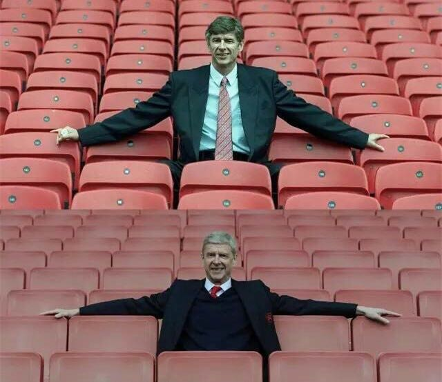
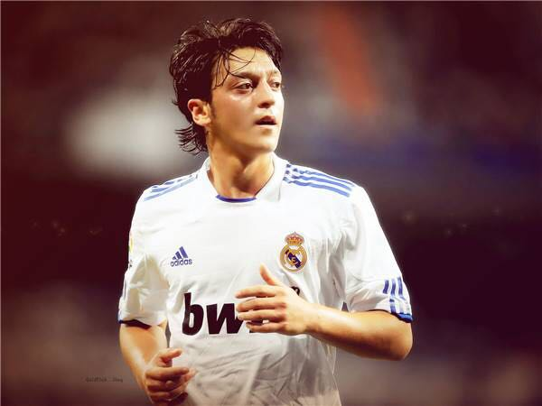
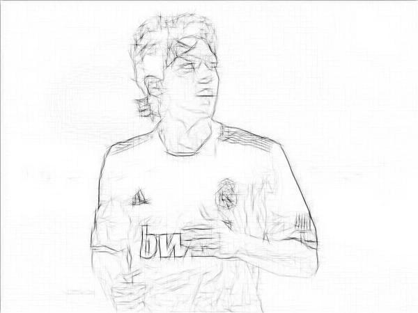
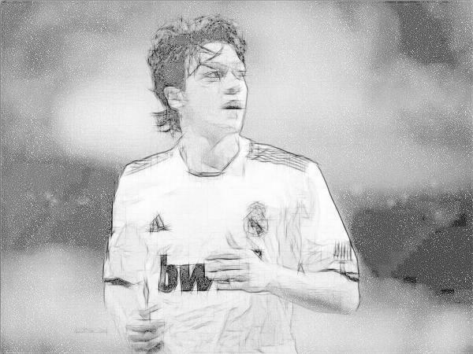
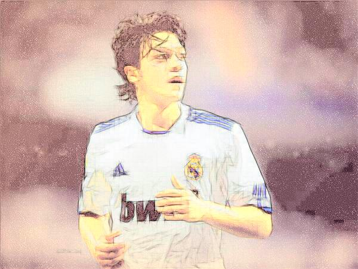
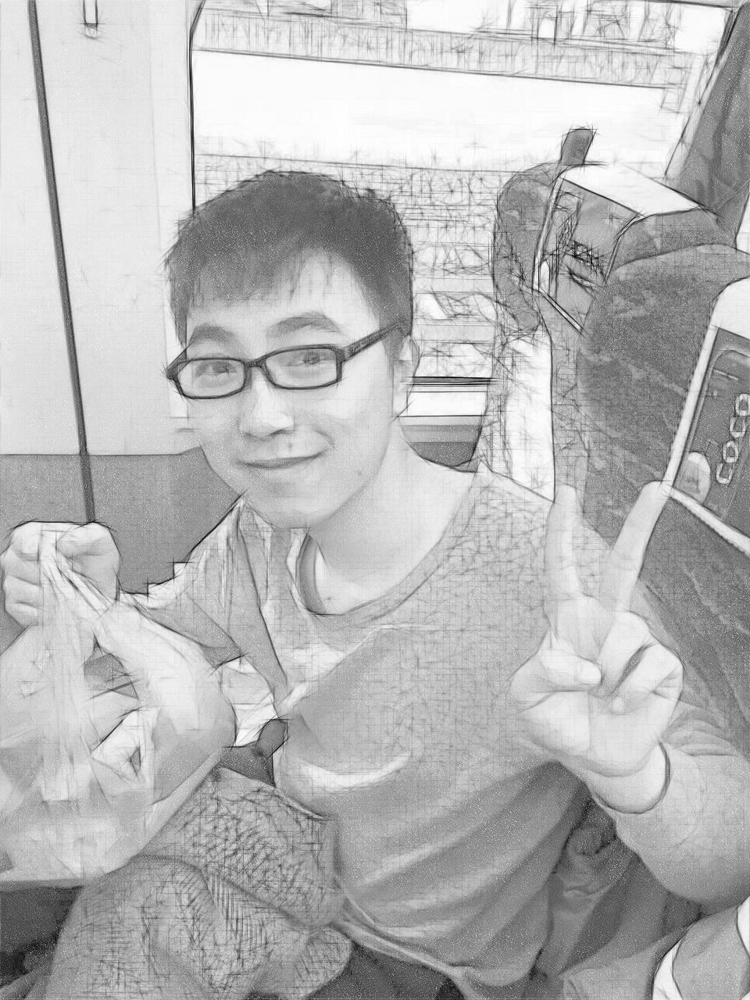
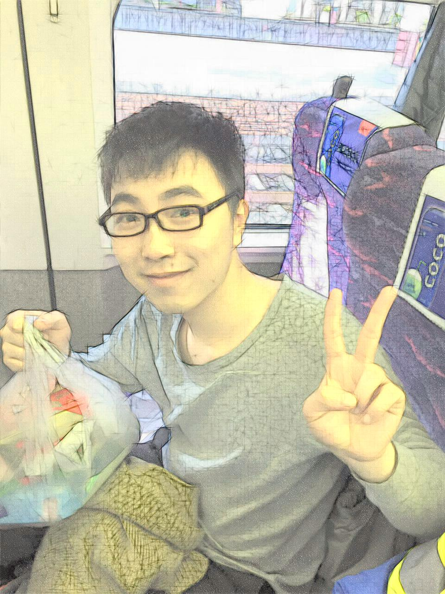
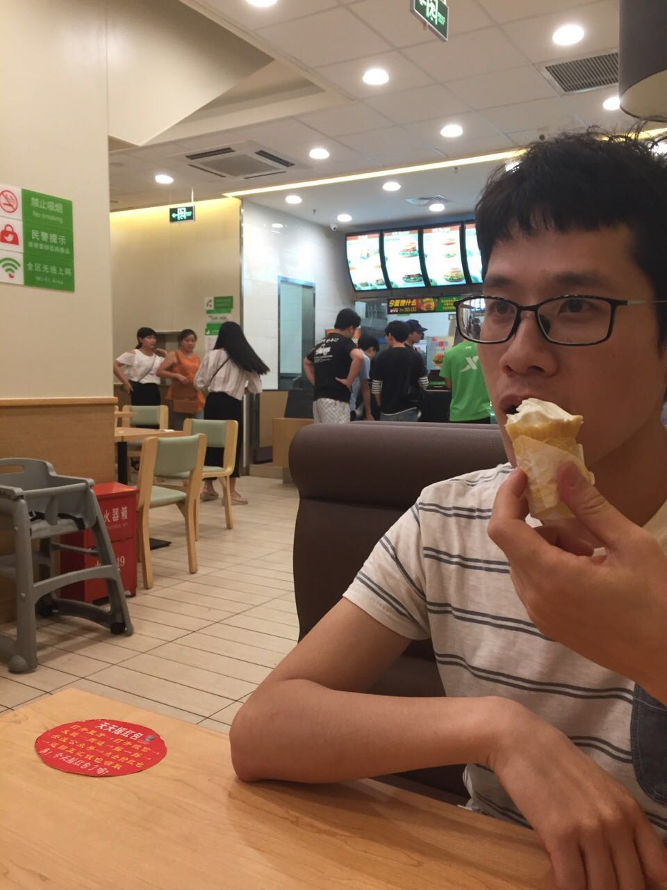
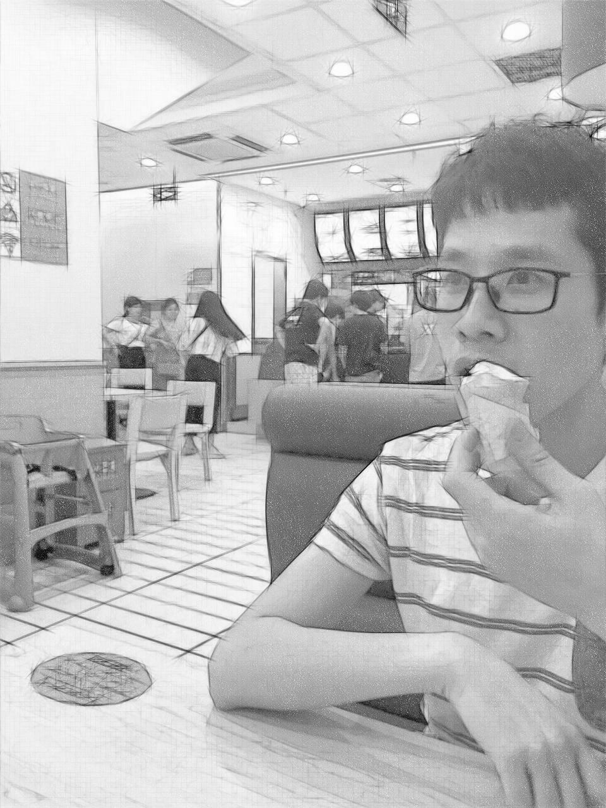

pencil-python：
===============================

##Author:

* [lizheming](http://lizheming.top)

* <nkdudu@126.com>

##Introduction:

A python version implementation of [Combining Sketch and Tone for Pencil Drawing Production](<http://www.cse.cuhk.edu.hk/leojia/projects/pencilsketch/pencil_drawing.htm>)。

I think it's interesting when I was introduced the paper. 

So even I know little about the area of image processing, I try to read the paper and find some open source implementation to help me understand.

I still have some confusion about the method, but finally I use python to reproduce the result. 

**This project is developed and tested on Mac OSX 10.10.5 with python 2.7.11 and Ubuntu 14.04 with python 2.7.6**

## Usage

### preparation

**clone this repository**

	git clone git@github.com:duduainankai/pencil-python.git
	cd pencil-python
	
**dependency**

The packages you need to install:

	Scipy
	numpy
	Pillow
	
**PS.** 

If you want to try the color pencil draw method, you need to install opencv in your environment, if just pencil draw wanted, the packages above is enough. 

To be honst, how to correctly install opencv is still a question for me. When I search it on google, someone just told me that use homebrew(or apt-get) is OK, but others said it's a wrong way and list many steps should be gone through.

I really got confused so at first I try my best not to use the opencv functions. But when I got to the last step(changing color from Ycbcr to RGB), I did all I can but still failed. Finally, **I simplely use homebrew or apt-get to install, and fortunately it works well**.

**run the program** 

* `python draw.py --p -img img/sign.png`
* there should be a floder named output where you can find the productions
* `python draw.py -h` 
*  for more arguments and explaination

## Productions

**Here are some original picture and productions of the method.**

	
	

Happy Birthday Arsene Wenger

	

	
	
	
	
	

Come on You Gunners!

	
	
	

@林导

	

	
	

@董小彬

#### You can visit [here](http://lizheming.top/blog/pencil) to see more productions.

## Reference

[1] [Lu C, Xu L, Jia J. Combining sketch and tone for pencil drawing production[C]](<http://www.cse.cuhk.edu.hk/leojia/projects/pencilsketch/pencil_drawing.htm>)

[2] [PencilDrawing By fumin](<https://github.com/fumin/pencil>)

[3] [PencilDrawing By cancat1992](<https://github.com/candycat1992/PencilDrawing>)

## Todos

- [ ] maybe an online version pencil drawing service

- [ ] figure out deeper insight of the paper and maybe refactor the code